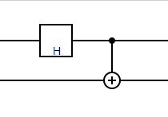

# Quantum Circuit Drawer

A library for drawing quantum circuits with customizable styles. Ideal for visualizing quantum algorithms and for educational purposes.

## Features

- **Comprehensive Gate Support:** Includes common quantum gates like Hadamard, Pauli-X, Pauli-Y, Pauli-Z, Rotation gates (Rx, Ry, Rz), and CNOT gates.
- **Customizable Styles:** Adjust colors, sizes, fonts, and more to personalize your circuit diagrams.
- **TypeScript Support:** Provides type definitions for type safety and IntelliSense support.
- **Browser and Node.js Compatibility:** Use the library in both browser environments and Node.js applications.
- **Easy Integration:** Simple API design for easy integration into your projects.

## Installation

Install the package via npm:

```bash
npm install quantum-circuit-drawer
```

## Getting Started

### Browser Usage

Include Dependencies:

```html
<!-- Include svg.js -->
<script src="https://cdnjs.cloudflare.com/ajax/libs/svg.js/3.2.4/svg.min.js"></script>
<!-- Include the quantum-circuit-drawer library -->
<script src="node_modules/quantum-circuit-drawer/dist/quantum-circuit-drawer.js"></script>
```

Set Up the HTML Container:

```html
<div id="circuit-container"></div>
```

Use the Library:

```html
<script>
  const { Circuit, Renderer, HadamardGate, CNOTGate } = QuantumCircuitDrawer;

  const circuit = new Circuit(2);
  circuit.addGate(new HadamardGate(0));
  circuit.addGate(new CNOTGate(0, 1));

  const renderer = new Renderer(circuit, "circuit-container");
  renderer.draw();
</script>
```



### Node.js Usage

Install svg.js:

```bash
npm install @svgdotjs/svg.js
```

Import the Library:

```typescript
import { SVG } from "@svgdotjs/svg.js";
import {
  Circuit,
  Renderer,
  HadamardGate,
  CNOTGate,
} from "quantum-circuit-drawer";

const circuit = new Circuit(2);
circuit.addGate(new HadamardGate(0));
circuit.addGate(new CNOTGate(0, 1));

const renderer = new Renderer(circuit, "circuit-container");
renderer.draw();
```

## Examples

### Basic Example

```html
<!DOCTYPE html>
<html lang="en">
  <head>
    <meta charset="UTF-8" />
    <title>Quantum Circuit Drawer Demo</title>
    <style>
      #circuit-container {
        width: 800px;
        height: 200px;
        border: 1px solid #ccc;
      }
    </style>
  </head>
  <body>
    <div id="circuit-container"></div>
    <!-- Include svg.js -->
    <script src="https://cdnjs.cloudflare.com/ajax/libs/svg.js/3.2.4/svg.min.js"></script>
    <!-- Include the quantum-circuit-drawer library -->
    <script src="node_modules/quantum-circuit-drawer/dist/quantum-circuit-drawer.js"></script>
    <script>
      const { Circuit, Renderer, HadamardGate, CNOTGate } =
        QuantumCircuitDrawer;

      const circuit = new Circuit(2);
      circuit.addGate(new HadamardGate(0));
      circuit.addGate(new CNOTGate(0, 1));

      const renderer = new Renderer(circuit, "circuit-container");
      renderer.draw();
    </script>
  </body>
</html>
```

### Custom Styles

```javascript
const customStyles = {
  gateFill: "#e0f7fa",
  gateStroke: "#006064",
  fontSize: 16,
  fontFamily: "Courier New, monospace",
  fontColor: "#006064",
  lineColor: "#004d40",
  qubitSpacing: 70,
  gateSpacing: 90,
};

const renderer = new Renderer(circuit, "circuit-container", customStyles);
renderer.draw();
```

## API Reference

### Classes

#### Circuit

Represents a quantum circuit composed of qubits and quantum gates.

##### Constructor

```typescript
constructor(numQubits: number)
```

- `numQubits`: The number of qubits in the circuit.

##### Methods

- `addGate(gate: IGate)`: Adds a gate to the circuit.

```typescript
circuit.addGate(new HadamardGate(0));
```

#### Renderer

Handles the rendering of the quantum circuit.

##### Constructor

```typescript
constructor(
  circuit: Circuit,
  containerId: string,
  styles?: Partial<StyleConfig>
)
```

- `circuit`: The Circuit instance to render.
- `containerId`: The ID of the HTML element where the circuit will be drawn.
- `styles`: (Optional) Custom styles for the circuit diagram.

##### Methods

- `draw()`: Renders the circuit diagram in the specified container.

```typescript
const renderer = new Renderer(circuit, "circuit-container", customStyles);
renderer.draw();
```

### Gate Classes

- **HadamardGate**
- **CNOTGate**
- **PauliXGate**
- **PauliYGate**
- **PauliZGate**
- **RotationGate**

Each gate class implements the `IGate` interface and represents a specific quantum gate.

```typescript
circuit.addGate(new PauliXGate(1));
circuit.addGate(new RotationGate("Y", 2, Math.PI / 4));
```

### Interfaces

#### IGate

Represents a generic quantum gate.

```typescript
interface IGate {
  name: string;
  qubits: number[];
}
```

#### StyleConfig

Defines the styling options for the circuit diagram.

**Properties:**

- `qubitSpacing`: Number (default: 50)
- `gateSpacing`: Number (default: 70)
- `gateWidth`: Number (default: 40)
- `gateHeight`: Number (default: 40)
- `lineColor`: String (default: '#000')
- `lineWidth`: Number (default: 2)
- `gateFill`: String (default: '#fff')
- `gateStroke`: String (default: '#000')
- `gateStrokeWidth`: Number (default: 2)
- `fontSize`: Number (default: 14)
- `fontFamily`: String (default: 'Arial, sans-serif')
- `fontColor`: String (default: '#000')

Example:

```typescript
const customStyles: Partial<StyleConfig> = {
  gateFill: "#ffe0b2",
  gateStroke: "#ef6c00",
  fontSize: 14,
  fontFamily: "Georgia, serif",
  fontColor: "#ef6c00",
  lineColor: "#bf360c",
  qubitSpacing: 60,
  gateSpacing: 80,
};
```

## License

This project is licensed under the [MIT License](LICENSE).
